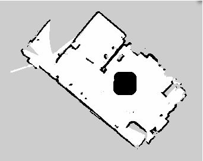
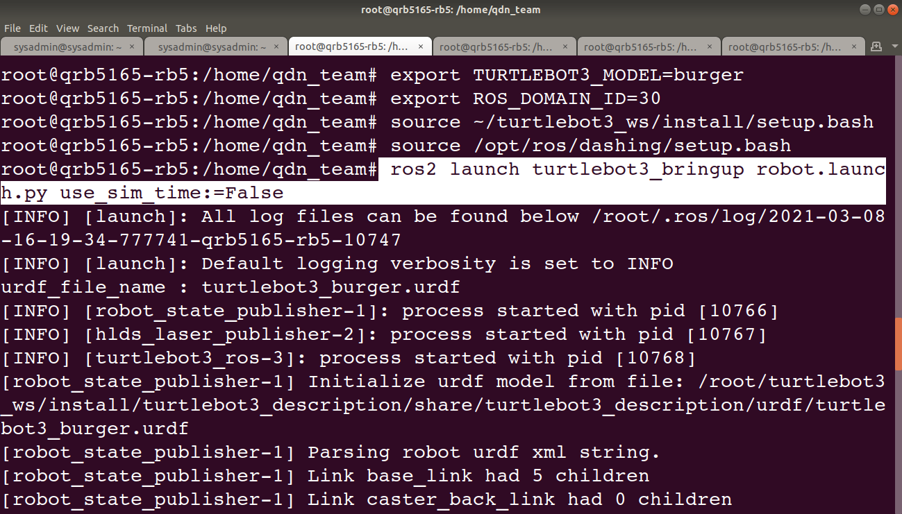
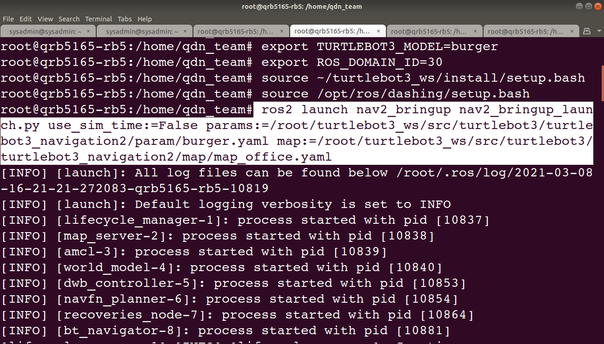
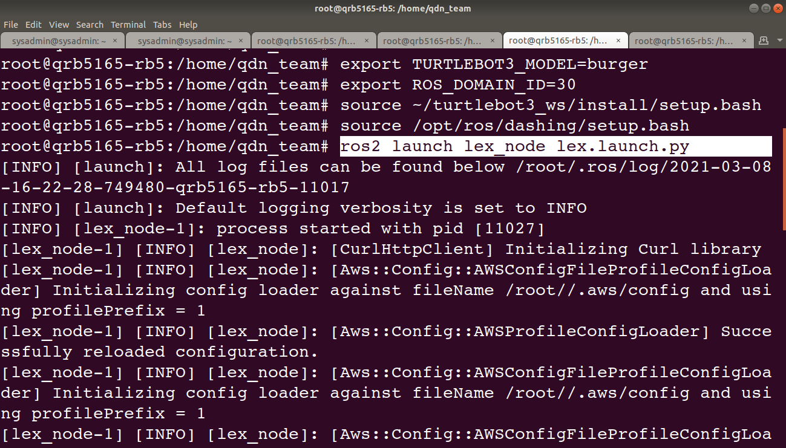
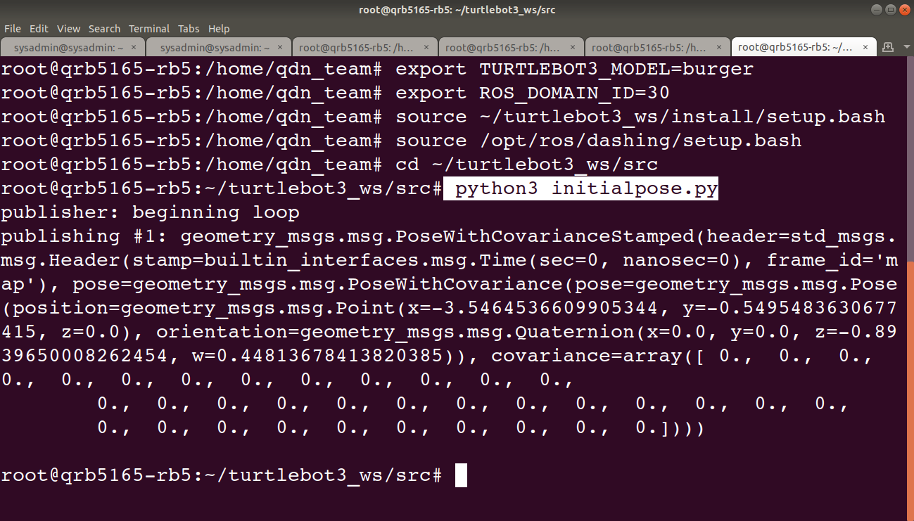
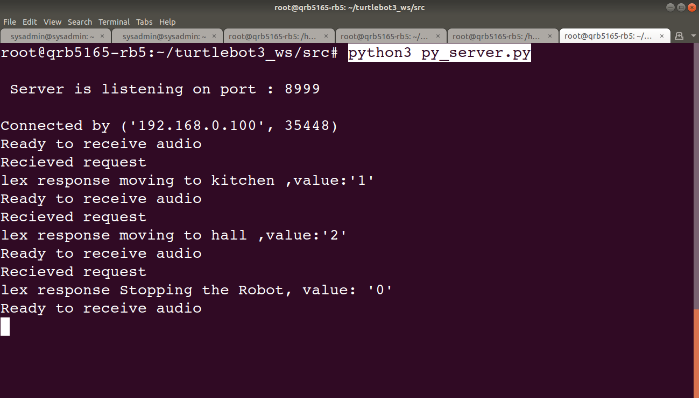
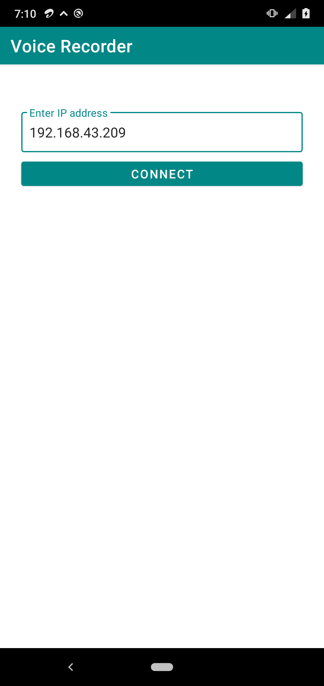
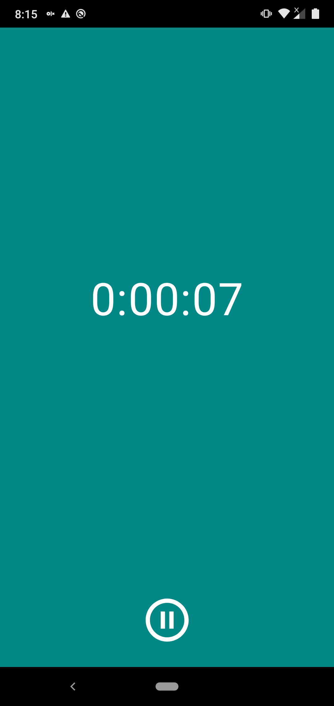
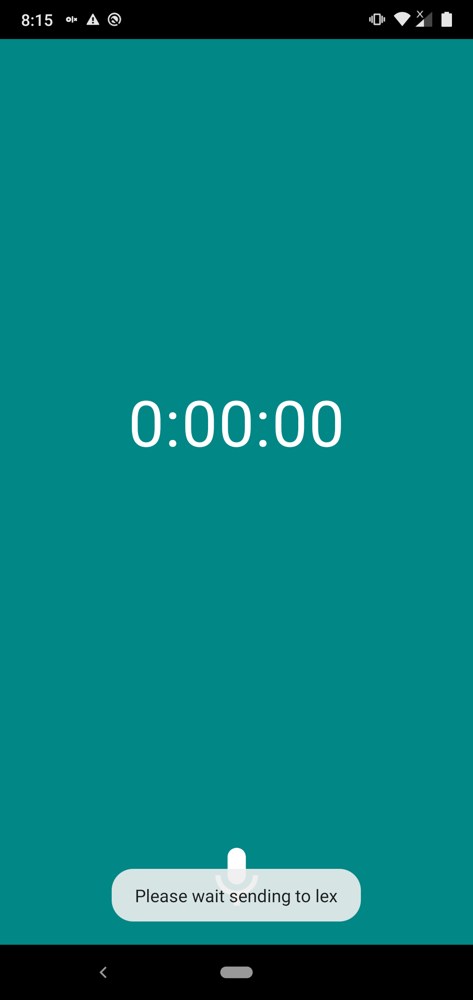

## Human-Voice Controlled Turtlebot navigation using Lex and ROS Navigation.


##### Introduction
This project is intended to demonstrate the controlling of turtlebot through Human voice(AWS Lex, Mobile application)and navigating the turtlebot autonomously in a given map using navigation stack on RB5.
Parking and Zone Restriction : Demonstration of turtlebot go and park in particular areas, taking the different path while there is “Restricted zone” in the given map.

The main objective of this document is to control the turtlebot through Human voice, process the voice through AWS Lex , autonomously navigating the turtlebot in the given map using ROS navigation.
And also demonstration of turtlebot taking the different path when there is a restricted zone in the way to reach the goal.

##### Prerequisites: 
1. Please create a directory voice-controlled-robot  in remote PC and clone the repo from Gitlab
   https://github.com/globaledgesoft/voice-controlled-robot
2. Install Android SDK tools (ADB, Fastboot) 
3. Install and configure the USB driver
4. Flash the RB5 firmware image on to the board
5. Setup serial port for debugging purpose
6. Wi-Fi connection is setup and internet is accessible
7. RB5 comes with ROS2 Dashing pre-installed
8. Python3 version 3.6.9 and Python 2.7.17
9. AWS lex-ros2 package
10. AWS CLI install and configuration
    https://docs.aws.amazon.com/cli/latest/userguide/install-cliv2-linux.html
    _curl "https://awscli.amazonaws.com/awscli-exe-linux-aarch64-2.0.30.zip" -o_ _"awscliv2.zip"_
    _unzip awscliv2.zip_
    _sudo ./aws/install_
11. Custom Lex skills (Path with respect to cloned repo)
    **~/voice-controlled-robot/Amazon lex.docx**
12. SLAM (Below path is with respect to cloned repo)
    **~/voice-controlled-robot/SLAM Techniques.docx**
13. AWS Lex-ros2 documentation(Below path is with respect to cloned repo)
    **~/voice-controlled-robot/QDN-RB5-AWS-RoboMaker-Sample-App-Lex-ros2.docx**
14. Android device API level 24 and above (Android 8 and above)


##### Build / Assembly Instructions

##### i.  Steps to Clone and Build necessary application Software on RB5.

###### 1.Turtlebot3 packages**
1. Creating new directory for TurtleBot 3
    ```
    mkdir -p ~/turtlebot3_ws/src && cd ~/turtlebot3_ws/src
    ```
2. Installing necessary packages for navigation:
    ```
    sudo apt install ros-dashing-navigation2
    sudo apt install ros-dashing-nav2-bringup
    ````
3. Clone necessary repositories & accessing TurtleBot Folder
    ```
    git clone -b ros2 https://github.com/ROBOTIS-GIT/hls_lfcd_lds_driver.git
    git clone -b ros2 https://github.com/ROBOTIS-GIT/turtlebot3_msgs.git
    git clone -b ros2 https://github.com/ROBOTIS-GIT/turtlebot3.git
    git clone -b ros2 https://github.com/ROBOTIS-GIT/DynamixelSDK.git
    ```
4. Source the TurtleBot3 Setup file 
    ```
    cd ~/turtlebot3_ws/src/turtlebot3
    export ROS_DOMAIN_ID=30
    export TURTLEBOT3_MODEL=burger
    source /opt/ros/dashing/setup.bash
    ```
5.  Build the Turtlebot packages
    ```
    cd ~/turtlebot3_ws/
    colcon build
    source ~/turtlebot3_ws/install/local_setup.bash
    ```
###### 2. Create AWS custom Lex bot
Please refer the below document for creation of Custom Lex bot and return response through serverless lambda function 
**~/voice-controlled-robot/Amazon lex.docx**
From the above blog will use the following LEX bot info
Bot_name : _Test_
Alias_name : _TestBot_

###### 3. Lex ROS2 packages
6. Navigate to catkin_ws directory.
    ```
    cd ~/turtlebot3_ws/src
    ```
7. Install Lex-Ros2 packages:
    ```
    git clone https://github.com/aws-robotics/lex-ros2.git -b release-latest
    ```
8. Modify the configuration file in config/sample_configuration.yaml to reflect the new alias create in the previous step (2.Create Custom Lex bot)
    ```
    bot_name: "Test"
    bot_alias: "TestBot"
    ```
9. Build and source
    ```
    cd ~/turtlebot3_ws/
    colcon build
    source ~/turtlebot3_ws/install/local_setup.bash
    ```
   
#### Usage Instructions

##### ii. Resource Setup
1. Fetch the coordinates from the  goal point (Kitchen, hall,outdoor,Room,initialposition,parking) by placing the robot in different places.
2. Keep the turtlebot kitchen location,and check the "ros2 topic echo /tf", 
3. Copy the coordinate(px,py,pz,ox,oy,oz) with respect "odom" to "basefootprint" value.
4. Repeat the step 2 and 3 for different location in home/apartment.
5. After fetching all goal point fetching, copy into config.txt file and save. (**~/voice-controlled-robot/HumanVoiceControlRobot/config.txt**)

##### iii. ROS2 and navigation stack setup

1. Source all the bash files in all RB5 terminal
    ```
    ssh root@{IP_ADDRESS_OF_RB5}
    export ROS_DOMAIN_ID=30
    export TURTLEBOT3_MODEL=burger
    source /opt/ros/dashing/setup.bash
    source ~/turtlebot3_ws/install/setup.bash
    ```
2. Run bring-up command inside rb5 to start the basic turtlebot3 applications 
    ```
    ros2 launch turtlebot3_bringup robot.launch.py use_sim_time:=False
    ```
3. Launch Navigation inside RB5
    Please prepare a map of your home/apartment as per instructions given in the **~/voice-controlled-robot/SLAM Techniques.docx**
Specify the path of the map yaml file.’
    ```
    ros2 launch nav2_bringup nav2_bringup_launch.py use_sim_time:=False params:=/path/to/burger.yaml  map:=/path/to/your-map.yaml
    ```
    **For Zone Restriction:**
    
    i. Install the GIMP tool (Editor tool)

       sudo apt-get install gimp

    ii.Open the map created by the Step.3 above, through gimp using below command

       gimp map.pgm

    iii.Mark the area in the map where you want to make it as a restricted zone in your home/apartment.

    
    
    [Alt tag: “ Restricted Zone marked map file”]
    
    iv. After marking restricted areas in map file,Export the map file in .PGM (zone_resticted_map.pgm)format.
    
    v. Launch Navigation inside RB5 with zone_restricted map file
    ```
    ros2 launch nav2_bringup nav2_bringup_launch.py use_sim_time:=False params:=/path/to/burger.yaml  map:=/path/to/your-zone_resticted_map.yaml
    ```
4. Launch the custom lex node created in the previous step.
    ```
    ros2 launch lex_node lex.launch.py
    ```
5. Run the server node present in the cloned repo path 
**~/voice-controlled-robot/HumanVoiceControlRobot/py_server.py** which receives audio from the android application.
    ```
    python3 py_server.py
    ```
5. Keep the turtlenot in initial pose point, run initialpose.py to set the  node present in the cloned repo path.
**~/voice-controlled-robot/HumanVoiceControlRobot/initialpose.py** it fetches the initial coordinate point stored in config.txt and set that as initialpose.
    ```
    python3 initialpose.py
    ```
6. Download and Install the lexNavigation.apk present in below cloned folder ~/voice-controlled-robot/lexNavigation.apk

    - Connect both android and RB5 to same wifi
    - Open the application and allow the internet and audio recording permissions.
    - Click on mic icon to start recording the audio 
    - Re-Click on the mic icon to stop and send the recording to the RB5 device.

##### iv. Screenshots of application execution.



[Alt tag: “ Terminal 1 : Running turtlebot3 bring up cmd on RB5”]



[Alt tag: ”Running Turtlebot3 Nav2 bring up cmd on RB5”]



[Alt tag: ”Terminal 3 : Running AWS Lex node on RB5”]



[Alt tag: ” Terminal 4 : Publishing initial pose of Turtlebot”]



[Alt tag: ”  Terminal 5 : Running the Server on RB5”]

###### Android Application Images



[Alt tag: ”Enter the IP address”]



[Alt tag: ”Recording audio ”]



[Alt tag: ”Sending to Lex”]


